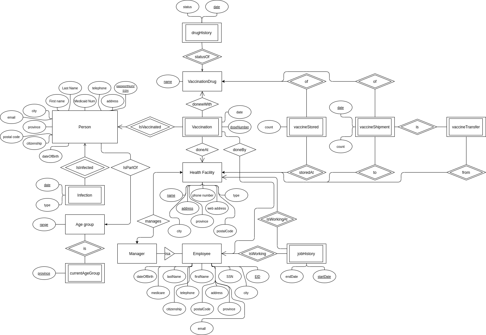

## Warmup project

### Part 1 - DESIGN

### Part 2 - Create
#### Person relation
```SQL
CREATE TABLE Person (
  medicaidNum  VARCHAR(10),
  telephone VARCHAR(13),
  firstName VARCHAR(100),
  lastName VARCHAR(100),
  address VARCHAR(255),
  city VARCHAR(255),
  province VARCHAR(3),
  postalCode VARCHAR(6),
  citizenship BOOLEAN,
  email VARCHAR(255),
  dateOfBirth DATE,
  PRIMARY KEY(medicaidNum)
);
```
#### Infection relation
``` SQL
CREATE TABLE Infection (
  dateInfection DATE,
  medicaidNum VARCHAR(10),
  PRIMARY KEY(dateInfection, medicaidNum)
);
```
#### AgeGroup relation
``` SQL
CREATE TABLE AgeGroup (
  ageRange VARCHAR(20),
  isCurrent BOOLEAN,
  PRIMARY KEY (ageRange)
);
```
#### Vaccination relation
``` SQL
CREATE TABLE Vaccination (
  medicaidNumber VARCHAR(10),
  doseNumber INT,
  date DATE,
  PRIMARY KEY (medicaidNumber, doseNumber)
);
```
#### PersonAgeGroup relation
``` SQL
CREATE TABLE PersonAgeGroup (
  ageRange VARCHAR(20),
  medicaidNum VARCHAR(10),
  PRIMARY KEY(ageRange, medicaidNum)
);  
```
#### VaccinationDrug relation
``` SQL
CREATE TABLE VaccinationDrug (
  name VARCHAR(100),
  status VARCHAR(50),
  dateLastStatus DATE,
  PRIMARY KEY (name)
);
```
#### VaccinationDoneWith relation
``` SQL
CREATE TABLE VaccinationDoneWith (
  medicaidNum VARCHAR(10),
  doseNumber INT,
  name VARCHAR(100),
  PRIMARY KEY (medicaidNum, doseNumber, name)
);
```
#### VaccinationDoneAt relation
``` SQL
CREATE TABLE VaccinationDoneAt (
  medicaidNum VARCHAR(10),
  doseNumber INT,
  name VARCHAR(100),
  address VARCHAR(100),
  PRIMARY KEY(medicaidNum, doseNumber, name, address)
);
```
#### HealthFacility relation
``` SQL
CREATE TABLE HealthFacility (
  name VARCHAR(100),
  address VARCHAR(100),
  phoneNumber VARCHAR(13),
  webAddress VARCHAR(100),
  type VARCHAR(8),
  PRIMARY KEY (name, address)
);
```

### Part 3 - Queries

1. > Get details of all the people who got vaccinated at least one dose and are of roup ages 4 to 10 (first-name, last-name, date of birth, email, phone, city, ate of vaccination, vaccination ype, been infected by COVID-19 before r not).
 ```SQL
SELECT Person.firstName, Person.lastName, Person.dateOfBirth, Person.email,
  Person.telephone, Person.city, Vaccination.date, VaccinationDoneWith.name,
  CASE 
    WHEN InfectionCount.cnt > 0 THEN 'True'
    ELSE 'False' 
  END AS wasInfected
FROM Person,PersonAgeGroup, Vaccination, VaccinationDoneWith, 
     (SELECT medicaidNum, COUNT(medicaidNum) AS cnt
      FROM Infection GROUP BY medicaidNum) AS InfectionCount
WHERE Person.medicaidNum = Vaccination.medicaidNumber AND
      Person.medicaidNum = PersonAgeGroup.medicaidNum AND
      Person.medicaidNum = VaccinationDoneWith.medicaidNum AND
      Person.medicaidNum = InfectionCount.medicaidNum AND
      Vaccination.doseNumber = VaccinationDoneWith.doseNumber AND
      (ageRange = "80+" OR ageRange = "70-79" OR ageRange = "60-69" OR
       ageRange = "50-59" OR ageRange = "40-49" OR ageRange = "30-39" OR
       ageRange = "18-29");
 ```

2. > Get details of all the Vaccination facilities in Québec (name, address, phone number, web address, type).
```SQL
SELECT name, address, phoneNumber, webAddress, type
FROM HealthFacility;
```
3. > Get details of all the people who got vaccinated at the Olympic Stadium in Montréal in January 2021 (first-name, last-name, date of birth, email, phone, city, date of vaccination, type of vaccination, group age).
```SQL
SELECT firstName, lastName, dateOfBirth, email, telephone, city, date,
      VaccinationDoneWith.name, ageRange
FROM Person, Vaccination, VaccinationDoneAt, VaccinationDoneWith, PersonAgeGroup
WHERE Person.medicaidNum = Vaccination.medicaidNumber AND
      Person.medicaidNum = VaccinationDoneAt.medicaidNum AND
      Person.medicaidNum = VaccinationDoneWith.medicaidNum AND
      Person.medicaidNum = PersonAgeGroup.medicaidNum AND
      Vaccination.doseNumber = VaccinationDoneWith.doseNumber AND
      Vaccination.doseNumber = VaccinationDoneAt.doseNumber AND
      VaccinationDoneAt.doseNumber = VaccinationDoneWith.doseNumber AND
      Vaccination.date >= "2021-01-01" AND
      Vaccination.date <= "2021-01-31" AND
      VaccinationDoneAt.name = "Olympic Stadium";
```
4. > Provide a description of all the vaccinations used in Québec (Name of the vaccination, date of approval of the vaccination, current status of the vaccination, total number of people vaccinated with the vaccination).
```SQL
   SELECT VaccinationDoneWith.name, dateLastStatus, status,
       COUNT(VaccinationDoneWith.name) as countVaccinated
   FROM Vaccination, VaccinationDoneWith, VaccinationDrug
   WHERE Vaccination.medicaidNumber = VaccinationDoneWith.medicaidNum AND
      VaccinationDoneWith.name = VaccinationDrug.name
   GROUP BY VaccinationDoneWith.name;
```
5. > Get details of all the people who got vaccinated with a vaccination that is currently suspended (first-name, last-name, date of birth, email, phone, city, date of vaccination, vaccination type, date of suspension of the vaccination).
```SQL
   SELECT firstName, lastName, dateOfBirth, email, telephone, city, Vaccination.date,
       VaccinationDoneWith.name, VaccinationDrug.dateLastStatus
   FROM Person, Vaccination, VaccinationDoneWith, VaccinationDrug
   WHERE VaccinationDoneWith.name = VaccinationDrug.name AND
      Person.medicaidNum = VaccinationDoneWith.medicaidNum AND
      Person.medicaidNum = Vaccination.medicaidNumber AND
      Vaccination.medicaidNumber = VaccinationDoneWith.medicaidNum AND
      Vaccination.doseNumber = VaccinationDoneWith.doseNumber AND
      VaccinationDrug.status = "SUSPENDED";
```
6. >  Provide a report of people who got vaccinated by city in all the cities in the province of Québec. The report should include the city name and the number of people vaccinated in each city.
```SQL
   SELECT city, COUNT(medicaidNum)
   FROM Person, Vaccination
   WHERE province = "QC" AND
      Person.medicaidNum = Vaccination.medicaidNumber
   GROUP BY city;
```

### Part 4 - Populate
#### Populate Person relation
```SQL
INSERT Person VALUES ("5418600 12", "(514)482-4299", "Annabel", "Dodson",
  "6860 Fielding", "Montreal", "QC", "H4V1P2", TRUE,
  "annabel.dodson@gmail.com", "1996-08-06");

INSERT Person VALUES ("7198638 80", "(514)366-4286", "Zachary", "Rutledge",
  " 902 Tittley", "Montreal", "QC", "H8R3X3", TRUE,
  "Zachary.Rutledge@gmail.com", "1986-08-12");

INSERT Person VALUES ("5867167 04", "(514)767-5030", "Alister", "Wiggins",
  "6818 Lamont", "Montreal", "QC", "H4E2T9", TRUE, "Alister.Wiggins@gmail.com",
  "1987-08-27"); 

INSERT Person VALUES ("9415548 75", "(514)525-4731", "Osman", "Vaughn", 
  " 1720 Bourbonniere", "Montreal", "QC", "H1W3N4", TRUE,
  "Osman.Vaughn@gmail.com", "2007-09-08"); 

INSERT Person VALUES ("9052864 70", "(514)768-9102", "Bear", "Melton",
  "5962 Jogues", "Montreal", "QC", "H4E2W3", TRUE, "Bear.Melton@gmail.com",
  "1976-09-13"); 

INSERT Person VALUES ("9826293 18", "(613)733-8502", "Lulu", "Fisher",
  "927 Rand", "Gatineau", "QC", "J9J1C8", TRUE, "Lulu.Fisher@gmail.com",
  "1976-09-27"); 

INSERT Person VALUES ("2055054 40", "(819)503-3196", "Collette", "Zavala",
  "60 Du Blizzard", "Gatineau", "QC", "J9A0C8", TRUE,
  "Collette.Zavala@gmail.com", "1956-09-29"); 

INSERT Person VALUES ("7247613 20", "(819)408-0531", "Angela", "Dodson",
  "1175 De L'Esplanade", "Sherbrooke", "QC", "J1H1S9", TRUE,
  "Angela.Dodson@gmail.com", "1956-10-15"); 

INSERT Person VALUES ("7976980 46", "(819)566-0668", "Annabel", "Crouch",
  "1812 Dunant", "Sherbrooke", "QC", "J1H6L4", TRUE,
  "Annabel.Crouch@gmail.com", "1936-10-18"); 

INSERT Person VALUES ("6623218 89", "(418)547-8256", "Nyle", "Sparrow",
  "3937 Soucy", "Jonquière", "QC", "G7X8T1", TRUE, "Nyle.Sparrow@gmail.com",
  "1936-12-08"); 

```
#### Populate Infection relation
``` SQL
INSERT Infection VALUES ("2021-03-16","5418600 12"); 
INSERT Infection VALUES ("2021-03-25","7198638 80"); 
INSERT Infection VALUES ("2021-04-02","5867167 04"); 
INSERT Infection VALUES ("2021-04-07","9415548 75"); 
INSERT Infection VALUES ("2021-04-30","9052864 70"); 
INSERT Infection VALUES ("2021-05-05","9826293 18"); 
INSERT Infection VALUES ("2021-05-20","2055054 40"); 
INSERT Infection VALUES ("2021-05-21","7247613 20"); 
INSERT Infection VALUES ("2021-06-18","7976980 46"); 
INSERT Infection VALUES ("2021-07-22","6623218 89"); 
```
#### Populate AgeGroup relation
``` SQL
INSERT AgeGroup VALUES ("80+", TRUE);
INSERT AgeGroup VALUES ("70-79", TRUE);
INSERT AgeGroup VALUES ("60-69", TRUE);
INSERT AgeGroup VALUES ("50-59", TRUE);
INSERT AgeGroup VALUES ("40-49", TRUE); 4 - 
INSERT AgeGroup VALUES ("30-39", TRUE);
INSERT AgeGroup VALUES ("18-29", TRUE);
INSERT AgeGroup VALUES ("12-17", TRUE);
INSERT AgeGroup VALUES ("5-11", TRUE);
INSERT AgeGroup VALUES ("0-4", TRUE);
```
#### Populate Vaccination relation
``` SQL
INSERT Vaccination VALUES ("5418600 12", 1, "2021-01-16"); 
INSERT Vaccination VALUES ("5418600 12", 2, "2021-05-16"); 
INSERT Vaccination VALUES ("7198638 80", 1, "2021-04-25"); 
INSERT Vaccination VALUES ("5867167 04", 1, "2021-05-02"); 
INSERT Vaccination VALUES ("9415548 75", 1, "2021-05-07"); 
INSERT Vaccination VALUES ("9052864 70", 1, "2021-01-30"); 
INSERT Vaccination VALUES ("9826293 18", 1, "2021-06-05"); 
INSERT Vaccination VALUES ("2055054 40", 1, "2021-06-20"); 
INSERT Vaccination VALUES ("7247613 20", 1, "2021-06-21"); 
INSERT Vaccination VALUES ("7976980 46", 1, "2021-07-18"); 
```
#### Populate PersonAgeGroup relation
``` SQL
INSERT PersonAgeGroup VALUES ("18-29","5418600 12"); 
INSERT PersonAgeGroup VALUES ("30-39","7198638 80"); 
INSERT PersonAgeGroup VALUES ("30-39","5867167 04"); 
INSERT PersonAgeGroup VALUES ("12-17","9415548 75"); 
INSERT PersonAgeGroup VALUES ("40-49","9052864 70"); 
INSERT PersonAgeGroup VALUES ("40-49","9826293 18"); 
INSERT PersonAgeGroup VALUES ("60-69","2055054 40"); 
INSERT PersonAgeGroup VALUES ("60-69","7247613 20"); 
INSERT PersonAgeGroup VALUES ("80+","7976980 46"); 
INSERT PersonAgeGroup VALUES ("80+","6623218 89");
```
#### Populate VaccinationDrug relation
``` SQL
INSERT VaccinationDrug VALUES ("Pfizer", "SAFE", "2020-06-21");
INSERT VaccinationDrug VALUES ("Moderna", "SAFE", "2020-06-21");
INSERT VaccinationDrug VALUES ("AstraZeneca", "SAFE", "2020-06-21");
INSERT VaccinationDrug VALUES ("Johnson & Johnson", "SUSPENDED", "2021-06-21");
INSERT VaccinationDrug VALUES ("RBD-Dimer", "SUSPENDED", "2021-01-01");
INSERT VaccinationDrug VALUES ("Covaxin", "SUSPENDED", "2021-01-01");
INSERT VaccinationDrug VALUES ("Ad5-nCoV", "SUSPENDED", "2021-01-01");
INSERT VaccinationDrug VALUES ("CIGB-66", "SUSPENDED", "2021-01-01");
INSERT VaccinationDrug VALUES ("KoviVac", "SUSPENDED", "2021-01-01");
INSERT VaccinationDrug VALUES ("EpiVacCorona", "SUSPENDED", "2021-01-01");
```
#### Populate VaccinationDoneWith relation
``` SQL
INSERT VaccinationDoneWith VALUES ("5418600 12", 1, "Pfizer"); 
INSERT VaccinationDoneWith VALUES ("5418600 12", 2, "Moderna"); 
INSERT VaccinationDoneWith VALUES ("7198638 80", 1, "Pfizer"); 
INSERT VaccinationDoneWith VALUES ("5867167 04", 1, "Moderna"); 
INSERT VaccinationDoneWith VALUES ("9415548 75", 1, "Pfizer"); 
INSERT VaccinationDoneWith VALUES ("9052864 70", 1, "Pfizer"); 
INSERT VaccinationDoneWith VALUES ("9826293 18", 1, "AstraZeneca"); 
INSERT VaccinationDoneWith VALUES ("2055054 40", 1, "AstraZeneca"); 
INSERT VaccinationDoneWith VALUES ("7247613 20", 1, "Johnson & Johnson"); 
INSERT VaccinationDoneWith VALUES ("7976980 46", 1, "Johnson & Johnson"); 
```
#### Populate VaccinationDoneAt relation
``` SQL
INSERT VaccinationDoneAt VALUES ("5418600 12", 1, "Olympic Stadium",
  "4545 Avenue Pierre-De Coubertin, Montréal, QC H1V 0B2"); 

INSERT VaccinationDoneAt VALUES ("5418600 12", 2, "Olympic Stadium",
  "4545 Avenue Pierre-De Coubertin, Montréal, QC H1V 0B2"); 

INSERT VaccinationDoneAt VALUES ("7198638 80", 1, "Jewish General Hospital",
  "3755 Chemin de la Côte-Sainte-Catherine, Montréal, QC H3T 1E2"); 

INSERT VaccinationDoneAt VALUES ("5867167 04", 1, "Jewish General Hospital",
  "3755 Chemin de la Côte-Sainte-Catherine, Montréal, QC H3T 1E2"); 

INSERT VaccinationDoneAt VALUES ("9415548 75", 1, "Olympic Stadium",
  "4545 Avenue Pierre-De Coubertin, Montréal, QC H1V 0B2"); 

INSERT VaccinationDoneAt VALUES ("9052864 70", 1, "Olympic Stadium",
  "4545 Avenue Pierre-De Coubertin, Montréal, QC H1V 0B2"); 

INSERT VaccinationDoneAt VALUES ("9826293 18", 1, "Hopital de Gatineau",
  "909 Boulevard la Vérendrye O, Gatineau, QC J8P 7H2"); 

INSERT VaccinationDoneAt VALUES ("2055054 40", 1, "Hopital de Gatineau",
  "909 Boulevard la Vérendrye O, Gatineau, QC J8P 7H2"); 

INSERT VaccinationDoneAt VALUES ("7247613 20", 1, "CHUS",
  "300 Rue King E, Sherbrooke, QC J1G 1B1"); 

INSERT VaccinationDoneAt VALUES ("7976980 46", 1, "CHUS",
  "300 Rue King E, Sherbrooke, QC J1G 1B1"); 
```
#### Populate HealthFacility relation
``` SQL
INSERT HealthFacility VALUES ("Olympic Stadium",
  "4545 Avenue Pierre-De Coubertin, Montréal, QC H1V 0B2", "(514)252-4141",
  "www.so.com", "SPECIAL"); 

INSERT HealthFacility VALUES ("Jewish General Hospital",
  "3755 Chemin de la Côte-Sainte-Catherine, Montréal, QC H3T 1E2",
  "(514)340-8222", "www.gjw.com", "HOSPITAL"); 

INSERT HealthFacility VALUES ("Hopital de Gatineau",
  "909 Boulevard la Vérendrye O, Gatineau, QC J8P 7H2", "(819)966-6100",
  "www.hg.com", "HOSPITAL"); 

INSERT HealthFacility VALUES ("CHUS",
  "300 Rue King E, Sherbrooke, QC J1G 1B1", "(819)346-1110", "www.chus.com",
  "HOSPITAL");

INSERT HealthFacility VALUES ("Hôpital Fleury",
  "2180, rue Fleury Est Montréal (Québec) H2B 1K3", "(514)384-2000",
  "www.hopitalFleury.com","HOSPITAL");

INSERT HealthFacility VALUES ("Hôpital Richardson",
  "5425, Avenue Bessborough Montréal (Québec) H4V 2S7", "(514)484-7878",
  "www.hopitalRichardson.com","HOSPITAL");

INSERT HealthFacility VALUES ("Hôpital Rivière-des-Prairies",
  "7070, boulevard Perras Montréal (Québec) H1E 1A4", "(514)323-7260",
  "www.hopitalRP.com","HOSPITAL");

INSERT HealthFacility VALUES ("Hôpital de Lasalle",
  "8585, Terrasse Champlain LaSalle (Québec) H8P 1C1", "(514)362-8000",
  "www.hopitalLasalle.com","HOSPITAL");

INSERT HealthFacility VALUES ("Hôpital de Verdun",
  "4000, boul. Lasalle Verdun (Québec) H4G 2A3", "(514)362-1C1000",
  "www.hopitalVerdun.com","HOSPITAL");

INSERT HealthFacility VALUES ("Hôpital de Sainte-Anne",
  "305, boulevard des Anciens-Combattants Sainte-Anne-de-Bellevue (Québec) H9X 1Y9",
  "(514)457-3440", "www.hopitalSaintAnne.com","HOSPITAL");
```
### Part 5 - DB Content
#### Person relation Content
```bash
mysql> SELECT COUNT(*) FROM Person;
+----------+
| COUNT(*) |
+----------+
|       10 |
+----------+
1 row in set (0.00 sec)
```
#### Infection relation Content
``` bash
mysql> SELECT COUNT(*) FROM Infection;
+----------+
| COUNT(*) |
+----------+
|       10 |
+----------+
1 row in set (0.00 sec)
```
#### AgeGroup relation Content
``` bash
mysql> SELECT COUNT(*) FROM AgeGroup;
+----------+
| COUNT(*) |
+----------+
|       10 |
+----------+
1 row in set (0.00 sec)
```
#### Vaccination relation Content
``` bash
mysql> SELECT COUNT(*) FROM Vaccination;
+----------+
| COUNT(*) |
+----------+
|       10 |
+----------+
1 row in set (0.01 sec)
```
#### PersonAgeGroup relation Content
``` bash
mysql> SELECT COUNT(*) FROM PersonAgeGroup;
+----------+
| COUNT(*) |
+----------+
|       10 |
+----------+
1 row in set (0.01 sec)
```
#### VaccinationDrug relation Content
``` bash
mysql> SELECT COUNT(*) FROM VaccinationDrug;
+----------+
| COUNT(*) |
+----------+
|       10 |
+----------+
1 row in set (0.01 sec)
```
#### VaccinationDoneWith relation Content
``` bash
mysql> SELECT COUNT(*) FROM VaccinationDoneWith;
+----------+
| COUNT(*) |
+----------+
|       10 |
+----------+
1 row in set (0.00 sec)
```
#### VaccinationDoneAt relation Content
``` bash
mysql> SELECT COUNT(*) FROM VaccinationDoneAt;
+----------+
| COUNT(*) |
+----------+
|       10 |
+----------+
1 row in set (0.00 sec)
```
#### HealthFacility relation Content
``` bash
mysql> SELECT COUNT(*) FROM HealthFacility;
+----------+
| COUNT(*) |
+----------+
|       10 |
+----------+
1 row in set (0.00 sec)
```